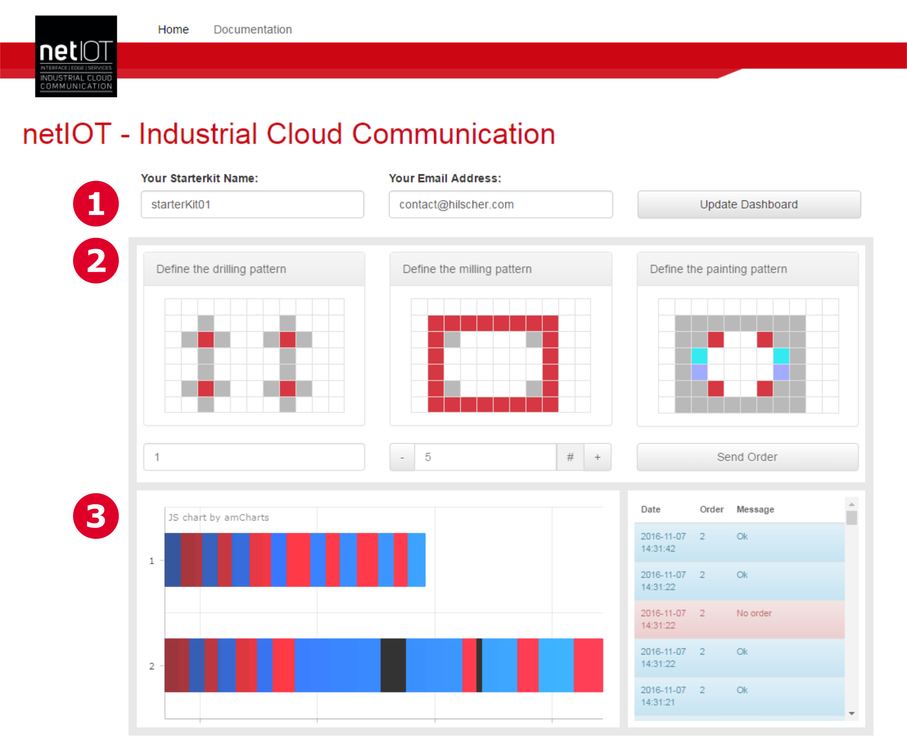
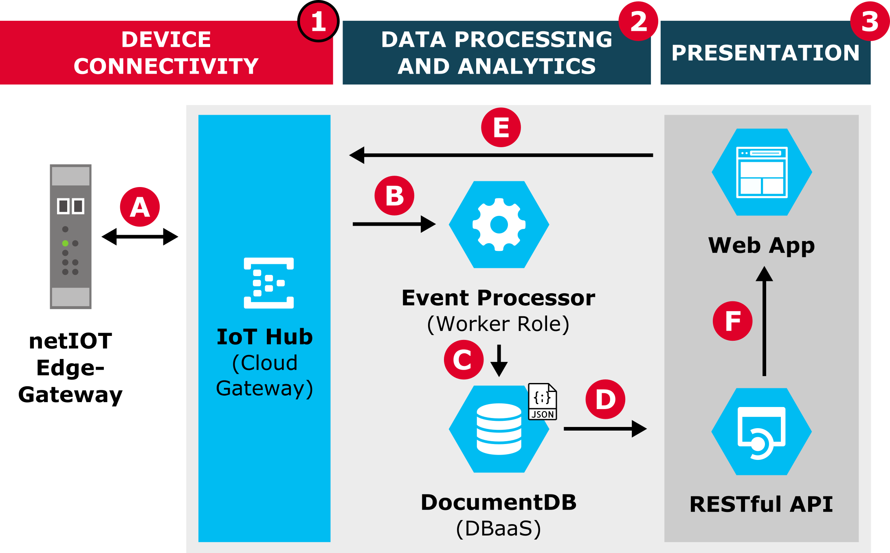
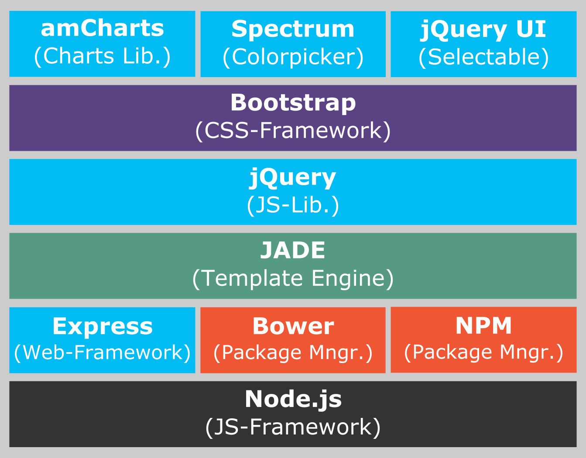

# netIOT Starterkit App

## General

This software is created for the netIOT Starterkit. The netIOT Starterkit App is a web application that demonstrates the sensor to cloud connectivity. This software can be be deployed on the Microsoft Azure Cloud.

The project consists of three parts:

* MonitoringWebApp: Web application dashboard implementation in HTML,CSS,JavaScript using Express with a simple RESTful API using NodeJS
* EventProcessorRole: Microsoft Azure Worker role implementation in C# processing Data from the Azure IoT Hub
* EventProcessor: Azure Worker Role Service Configurations

## Configuration

1. Execute npm install in your console
2. Configure the Azure IoT Hub Connection and the DocumentDB Connection Data in the MonitoringWebApp/lib/config.js and also in the EventProcessorRole/WorkerRole.cs.
3. Configure EventProcessor/ServiceConfiguration.Cloud.cscfg and EventProcessor/ServiceConfiguration.Local.cscfg in order to publish the Worker Role to Azure.

## Application Screenshot

## Architecture Diagrams

## Technology Stack

## Licence

This software is licensed unter MIT licence.

